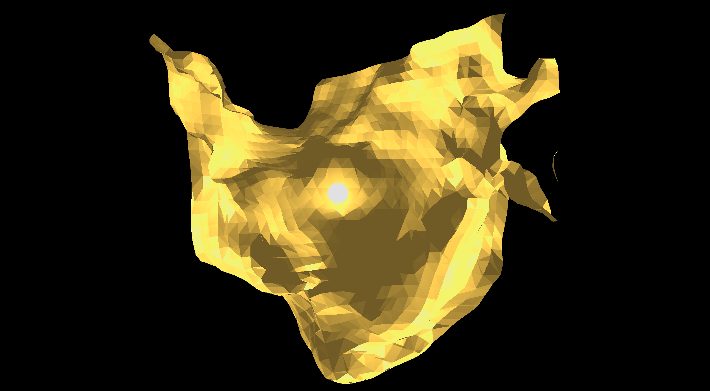
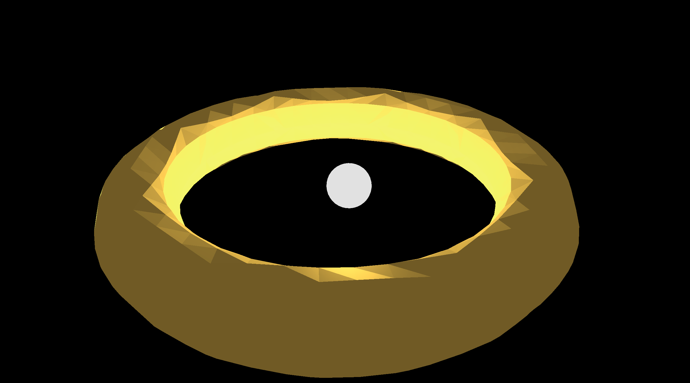

# ProceduralGeneration



> Current state of the application: Spherical Light with a marching cubes generated torus around it.

Real-time terrain generation in a 3D world from a procedural density field. CUDA kernels are responsible for evaluating
the density field and extracting a mesh out of it via Marching Cubes, which then can be drawn by OpenGL.

## Building

### With CMake Workflow

1. Run workflow
    ```bash
    cmake --workflow --preset <platform>-<type>
    ```

    where ```<platform>``` can be any of ```gcc```, ```clang```, and ```windows``` and ```<type>``` can be either ```release```,
    or ```debug```.

3. Run the Application

    ```bash
    ./build/<type>/src/app/StarfighterAlliance
    ```

### Manually

1. Configure CMake

    ```bash
    cmake --preset release
    ```

2. Build the Application

    ```bash
    cmake --build --preset release
    ```

3. Run the Application

    ```bash
    ./build/release/src/app/StarfighterAlliance
    ```

## Notes on Tests in CI

The Windows CI environment is not able to run tests that require OpenGL. Because of that, tests that require OpenGL are
labeled as such and can be filtered out by ctest.

## Acknowledgments / Credits

- [LearnOpenGL.com](https://learnopengl.com/)
- [OpenGL Sphere](https://www.songho.ca/opengl/gl_sphere.html)

## History


> First stage of the project: A torus with a lighting sphere in the center
